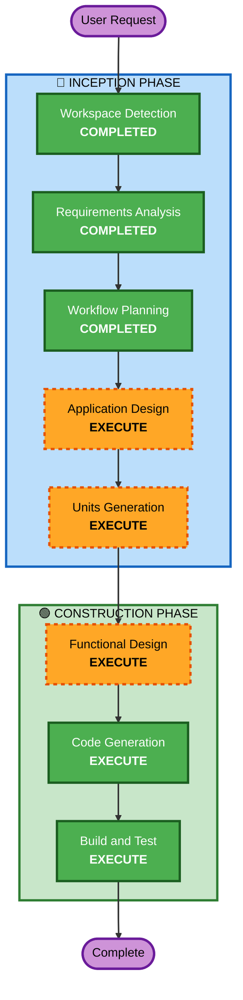

# Execution Plan

## Detailed Analysis Summary

### Change Impact Assessment
- **User-facing changes**: Yes - 고객용 주문 UI + 관리자 대시보드 신규 구축
- **Structural changes**: Yes - 전체 시스템 신규 설계 (Next.js 풀스택)
- **Data model changes**: Yes - 전체 데이터 모델 신규 설계 (SQLite + Prisma)
- **API changes**: Yes - REST API 전체 신규 설계 + SSE 엔드포인트
- **NFR impact**: No - 소규모 MVP, 보안 확장 미적용

### Risk Assessment
- **Risk Level**: Low (Greenfield, 소규모, 로컬 환경)
- **Rollback Complexity**: Easy (신규 프로젝트)
- **Testing Complexity**: Moderate (SSE 실시간 통신 포함)

## Workflow Visualization



### Text Alternative
```
Phase 1: INCEPTION
  - Workspace Detection (COMPLETED)
  - Requirements Analysis (COMPLETED)
  - Workflow Planning (COMPLETED)
  - Application Design (EXECUTE)
  - Units Generation (EXECUTE)

Phase 2: CONSTRUCTION
  - Functional Design (EXECUTE, per-unit)
  - Code Generation (EXECUTE, per-unit)
  - Build and Test (EXECUTE)
```

---

## Phases to Execute

### 🔵 INCEPTION PHASE
- [x] Workspace Detection (COMPLETED)
- [x] Requirements Analysis (COMPLETED)
- [x] User Stories - SKIP
  - **Rationale**: 단일 매장 MVP, 사용자 유형이 명확 (고객/관리자), 요구사항이 충분히 상세
- [x] Workflow Planning (COMPLETED)
- [ ] Application Design - EXECUTE
  - **Rationale**: 신규 프로젝트로 컴포넌트 식별, 서비스 레이어 설계, API 설계 필요
- [ ] Units Generation - EXECUTE
  - **Rationale**: 고객용/관리자용/공통 백엔드 등 복수 유닛으로 분해 필요

### 🟢 CONSTRUCTION PHASE
- [ ] Functional Design - EXECUTE (per-unit)
  - **Rationale**: 데이터 모델, 비즈니스 로직, API 상세 설계 필요
- [ ] NFR Requirements - SKIP
  - **Rationale**: 소규모 MVP, 보안 확장 미적용, 특별한 NFR 요구 없음
- [ ] NFR Design - SKIP
  - **Rationale**: NFR Requirements 건너뛰므로 해당 없음
- [ ] Infrastructure Design - SKIP
  - **Rationale**: 로컬 개발 환경만 사용, 클라우드 인프라 불필요
- [ ] Code Generation - EXECUTE (per-unit, ALWAYS)
  - **Rationale**: 실제 코드 구현 필요
- [ ] Build and Test - EXECUTE (ALWAYS)
  - **Rationale**: 빌드 및 테스트 지침 필요

### 🟡 OPERATIONS PHASE
- [ ] Operations - PLACEHOLDER

---

## Extension Compliance Summary
| Extension | Status | Rationale |
|---|---|---|
| security-baseline | Disabled | 사용자 선택 (Q9: B) - MVP/프로토타입 수준 |

## Success Criteria
- **Primary Goal**: 단일 매장용 테이블오더 MVP 서비스 구현
- **Key Deliverables**: Next.js 풀스택 앱 (고객 UI + 관리자 UI + API + SQLite DB)
- **Quality Gates**: 빌드 성공, 핵심 주문 플로우 동작, SSE 실시간 업데이트 동작
